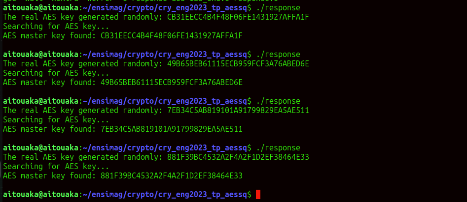

# Technical Report - AES Attack and Related Function Implementations

---
## How to Compile and Run the Code

To compile and run the AES attack project, follow these steps:

Open Terminal: Navigate to your project directory:
   ```bash
   $ cd path/to/cry_eng2023_tp_aessq
   $ make # Compile the Code
   $ make run # Run the Program
   ```
---


### Explanation of the `xtime` Function

The `xtime` function in the `aes-128_enc.c` file performs multiplication by 2 in the finite field \( $F_2[X]/X^8 + X^4 + X^3 + X + 1$ \) used in AES. Its primary role is to support the MixColumns operation.

1. **Left Shift**: The function left-shifts the input byte `p` by 1 bit, effectively multiplying it by 2.
2. **Reduction**: If the original value of `p` has its most significant bit (MSB) , it is reduced using the polynomial \($ X^8 + X^4 + X^3 + X + 1 $\). This is done by XORing with the constant `0x1B`.
3. **Final Result**: The final output is the XOR of the left-shifted value and the reduction term.

#### Code:
```c
    uint8_t m = p >> 7; //extract the most significant bit of p by shifting right 7 bits.
    m ^= 1; //if the MSB is set (m = 1) prepare to reduce by XORing with 1.
    m -= 1; //adjust m so that if the MSB was set, m becomes 0 otherwise, it remains 1
    m &= 0x1B; //use m to determine if we need to XOR with 0x1B for reduction.
    return ((p << 1) ^ m); //left shift p by 1 (multiply by 2) and XOR with m for reduction
```

### Variant of `xtime` for a Different Polynomial

Here’s a variant of `xtime` that uses the polynomial \($ X^8 + X^6 + X^5 + X^4 + X^3 + X + 1$ \):

#### Code:
```c
uint8_t my_xtime(uint8_t p) {
    uint8_t m = p >> 7;
    m ^= 1;
    m -= 1;
    m &= 0x7B; // 0x7B corresponds to the new polynomial
    return ((p << 1) ^ m);
}
```

### Explanation of the Variant:
- This function also left-shifts the input by 1.
- It uses `0x7B` for reduction, which corresponds to the new polynomial.
- The structure is similar to the original `xtime`, ensuring constant-time operation.

---

##  Key Expansion - `prev_aes128_round_key`

The function `prev_aes128_round_key` is implemented to reverse the AES key schedule, calculating the previous round key given the current one. This function is the inverse of `next_aes128_round_key`, which generates the next round key.

`prev_aes128_round_key` is in [aes-128_enc.c](./aes-128_enc.c) 

The correctness of `prev_aes128_round_key` is confirmed by iterating forward through the key schedule and then reversing it, ensuring that the original master key is recovered at the end.


---

## Keyed Function F Construction

A keyed function \( F \) is constructed using two AES encryption rounds, defined as \( F(k1 $||$ k2, x) = E(k1, x)  $ \oplus $ E(k2, x) \). This construction requires \( k1 $\neq$ k2 \) to prevent trivial outputs. The implementation includes a test program that verifies the function’s output when \( k1 = k2 \) and when \( k1 $\neq$ k2 \), demonstrating how different keys ensure non-trivial encryption results.

`aes_keyed_function` is in [`response.c`](./response.c) file.


### Note 

When \( $k_1 = k_2 $\), the output will be \($ 00000000 \ldots$ \) for all inputs. Therefore, ensuring that \($ k_1 \neq k_2 $ \) is essential for the functionality of \( $F $\).


---

## Exercice 2 : Key Recovery Attack on AES with Square Distinguisher

### Question 1 :
the attack function `attack_aes()` is in [`response.c`](./response.c) file.
This attack involves the following steps:

1. **Generate Random AES Key** 
2. **Set up Λ-Sets**: An array of  blocks, known as a Λ-set (in the code `lambda_set`), is created to test the distinguisher properties.
3. **Iterative Key Byte Guessing**
4. **Master Key Recovery**

The attack is tested by generating multiple random keys and comparing the recovered key with the original. Each test confirms whether the attack successfully retrieves the master key.


### Question 2 :

Despite these modifications leading to different ciphertexts, the square attack remained effective against the altered cipher.


---
